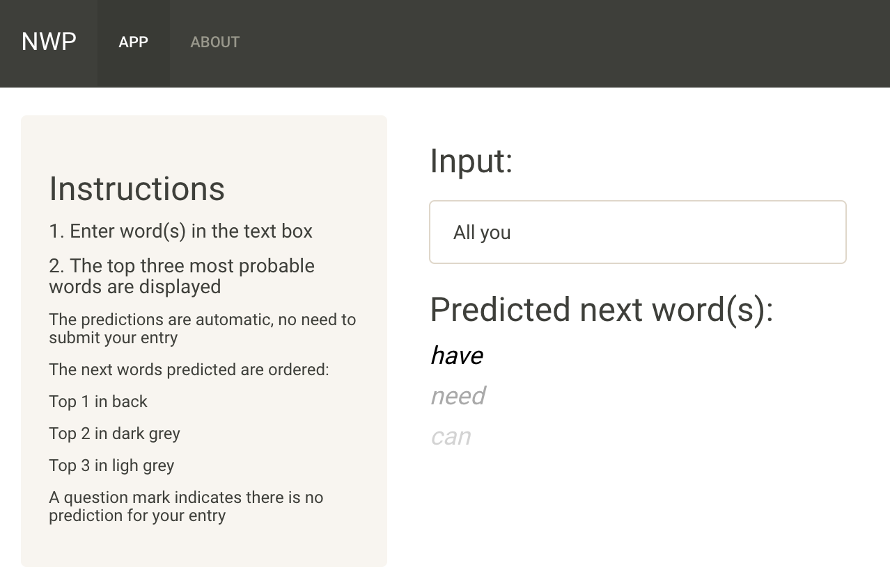

Next Word Prediction (NWP)
========================================================
author: Céline Barlier
date: January 30th, 2022
autosize: true

Introduction
========================================================

**Problem**: Around the world, people are spending a considerable amount of time to write messages or posts on their phone/computer. However, this process can be laborious and several companies such as SwiftKey *(corporate partner of this Captsone)* implemented smart keyboards based on predictive text models to make it easier for people to type their text.

**Capstone project**: the aim of this project is to apply all knowledge and skills we acquired during the specialization to build a predictive text product.

Resources:
  - "Text Mining Infrastructure in R" - *Ingo Feinerer, Kurt Hornik, David Meyer; Journal of Statistical Software 2008* **(https://www.jstatsoft.org/article/view/v025i05)**
  - Natural Language Processing in R **(https://cran.r-project.org/web/views/NaturalLanguageProcessing.html)**
  - Stanford Natural Language Processing course **(https://web.stanford.edu/~jurafsky/NLPCourseraSlides.html)**

*Coursera capstone project link*: https://www.coursera.org/learn/data-science-project

Data Preparation
========================================================

This project has been done using the data provided including: Twitter, News and Blog datasets. The pre-processing of the data, model development and product implementation was done in R.

*Link to the original data*: https://d396qusza40orc.cloudfront.net/dsscapstone/dataset/Coursera-SwiftKey.zip

**Data processing**:
- **Compilation**: The three datasets were merged together and sampled 10 times with a size of 20 000 elements.
- **Cleaning**: The compiled corpus was cleaned as follow: 
  * Removing non-English characters, URLs, repetition of words, text within brackets, Twitter #, emails, punctuations, numbers and extra white spaces, 
  * Replacing abbreviations, 
  * Transforming all words to lower case.
  * *Future optimization: dealing with words that are misspelled*

Predictive Model
========================================================

The model for the next word predictions is based on pre-compiled N-gram databases and a backing-off algorithm.

- **N-gram databases construction**: bigrams *(N2-grams)*, trigrams *(N3-grams)* and quadrigrams *(N4-grams)* databases were built using the constructed corpus. For each token, the three most probable next words were kept. Each N-gram database contains the token and its frequency, sorted by highest frequency.
- **Algorithm**: depending on the number of words entered by the user, the appropriate N-gram database is selected:
  1. **One word**: the N2-grams database is used to return the three most probable next words
  2. **Two words**: the N3-grams database is used to return the three most probable next words
  3. **Three words and more** - **backing-off algorithm**: the N4-grams database is first used. If no prediction is found, the N3-grams one is used with the two last words provided by the user. If there is still no prediction, the N2-grams one is used with the last word provided.
  4. *In case no prediction is found, the user will observe a question mark under its entry.*

**Code**: https://github.com/BarlierC/NWP.git

Product
========================================================

**Shiny app**:  https://cbarlier.shinyapps.io/NWPapp/

